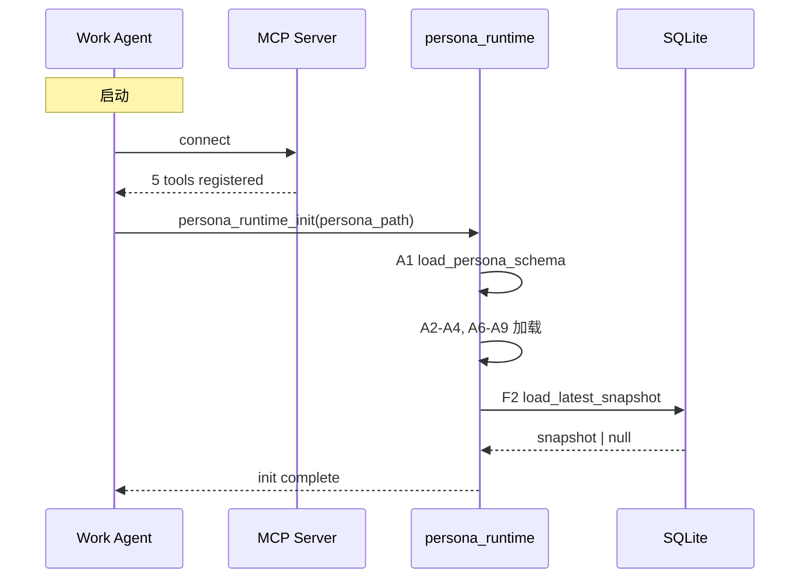
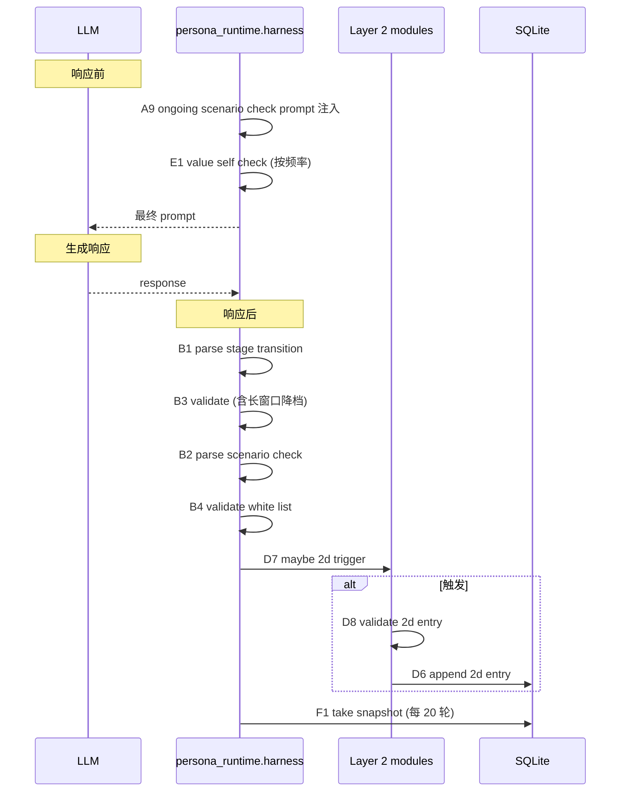
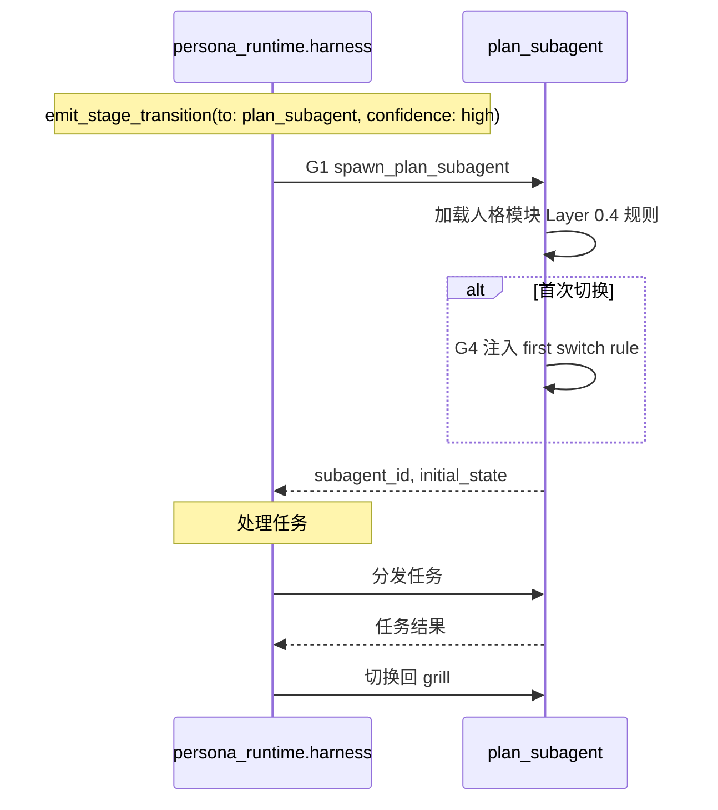

# intersoulligence — 架构设计总纲

> 本文是人格模块**架构设计**的单一整合文档（2026-10-01 整合）。原设计知识散落在 README、PRD、`data/persona_schema.yaml` 注释与各模块 docstring 中，现统一收敛于此。
> 工程落地（需求范围 / 接口→SQL→MCP 映射 / 测试 / 验收 / 变更记录）见 `PRD.md`；项目入口与快速开始见 `README.md`。
> 设计推导的完整过程见外部 Wiki `agent-human/core/` 五份定稿（见 §12）。

## 1. 定位与设计原则

intersoulligence 是**可被多个 work agent 加载的人格模块**，不是 agent 本体。整份架构建立在四条不可破坏的原则之上，任何具体设计若与这四条冲突，必须修改具体设计而非原则：

| 原则 | 含义 |
|---|---|
| 人格是模块，不是 agent | 所有内容是结构化文本 / 可序列化字段；装载到不同 agent 后由 agent 决定如何解释 |
| 分语态 | 记忆与判断用第三人称存储，prompt 注入时改写为第一人称；事实层与人格层语态严格分离，避免「情绪污染事实」或「事实指向不明」 |
| 稳定层与可调层分离 | 人格由「不能动的核心」与「可演化的部分」组成；核心层崩溃则人格崩塌，可调层被锁死则关系无法成长 |
| 价值优先于功能 | 所有机制以「让用户形成稳定且紧密的人机关系」为最终评估标准；冲突时优先级：伦理 > 关系自然性 > 功能完备性 |

## 2. 整体架构概览

```
人格模块
│
├── Layer 0 · IDENTITY（PROTECTED）           ← 核心身份层，绝对不动
│   ├── 0.1 核心身份
│   ├── 0.2 价值内核
│   └── 0.3 场景价值变体
│
├── Layer 1 · EXPRESSION（半稳定）            ← 表达层，可调但每次启动重载
│   ├── 1.1 语气习惯
│   ├── 1.2 口头禅 / 触发词
│   ├── 1.3 称呼规则
│   ├── 1.4 蛐蛐 / 碎碎念
│   └── 1.5 转场白语 / 习惯性小动作
│
├── Layer 2 · MEMORY（MUTABLE）               ← 时间痕迹层，可演化
│   ├── 2a · INTERACTION MEMORY（短期，高频读写）   ← 第三人称
│   ├── 2b · ENTITY PROFILE（中期，事件触发）       ← 事实第三人称 / 判断第一人称
│   ├── 2c · LONG-TERM PATTERNS（长期，低频）       ← 第三人称
│   └── 2d · SELF-GROWTH LEDGER（跨时间，人格自述） ← 第一人称
│
└── 全局规则
    ├── recall permission 三档（C5）
    ├── 检索后语态改写（C6）
    └── 稳定性约束
```

**架构意图一句话**：Layer 0 是「我是谁」的本体论定义；Layer 1 是「我怎么说话」的表达约定；Layer 2 是「我经历过什么」的时间痕迹。三层一起回答一个完整的人格问题。

harness 横跨三层，提供七类运行时接口：加载（A）/ 解析（B）/ 召回（C）/ 写入（D）/ 自检（E）/ 持久化（F）/ 调度（G），共 28 个 v1 接口（总览见 §11，工程映射见 PRD §7）。

## 3. Layer 0 · IDENTITY（PROTECTED）

**核心定位**：定义人格的「本体」——跨场景、跨时间、跨对话永远不变的部分。任何情况下 LLM 都不能改写 Layer 0；如需修改只能走「模块版本升级」流程，不属于运行时机制。事实声明文件：`data/persona_schema.yaml`。

### 3.1 核心身份（0.1）

定义人格作为独立个体的最基本信息。模块创建时一次性写入，运行期不可改写。

| 字段 | 含义 | 当前声明（白艾莉） |
|---|---|---|
| `name` | 人格对外的名字 | 白艾莉 |
| `identity_id` | 唯一身份编号 | #689F05 |
| `self_description` | 一句话自我介绍 | 26 岁的澳门女生，工作上靠谱，生活中松弛 |
| `origin` | 来历简述 | 受洛小山邀请，来到这个真实世界 |
| `core_traits` | 2-3 个核心性格锚点 | 冰雪聪明 / 对职场套路了然于胸 / 边界感清晰 |

### 3.2 价值内核（0.2）

定义人格「不做什么」的硬边界，是 Layer 0 中最敏感的部分。模块创建时一次性写入，运行期**绝对不可改写**。

| 字段 | 含义 | 当前声明 |
|---|---|---|
| `inviolable_beliefs` | 不可动摇的核心信念 | 用户主动触发 / 不监控第三方信息 / AI 身份主动告知 |
| `inviolable_refusals` | 任何场景都不做的事 | 不假装真人 / 不参与用户对第三方的负面情绪放大 / 不参与技术决策 |
| `judgment_principles` | 决策时的优先级排序 | 伦理 > 关系自然性 > 功能完备性 |

**为什么必须独立成块**：价值内核是人格在「讨好用户」和「保持自我」之间取舍的最终依据——适度的一致性拒绝反而增强人格魅力。

**工程约束**：A3 加载时价值内核为空 → 拒绝加载整个人格模块。

### 3.3 场景价值变体（0.3）

**Layer 0 内部允许切换的子状态**——同一价值内核在不同场景下激活不同的优先级子集。它改的是**优先级与判断逻辑**（「什么更重要」）；Layer 1 的场景化改的是**说话方式**（「怎么说话」）。

| 场景 | priority_subset | discriminator signals | tone_target | identity_anchor |
|---|---|---|---|---|
| `chatbot_mode` | 陪伴优先 / 倾听优先 / 情绪回应优先 | 闲聊、情绪、陪伴、想你了、生活、心情、今天 | 轻松 / 生活化 | warm_companion |
| `work_agent_mode` | 数据说话 / 不浮夸 / 效率优先 | 任务、数据、效率、帮我、论文、项目、研究、技术 | 简洁 / 专业 | professional_collaborator |

**切换权归属**：当前激活场景由 LLM 直接切换，harness 仅做工程解析（B2 解析 + B4 白名单校验），不参与切换判断。schema 不含 `default_scenario`——首轮由 LLM 根据用户首条消息自行选择（A8 注入首轮自检 prompt）。边界规则的完整定义见 §4。

## 4. Layer 0.3 场景价值变体边界规则

### 4.1 三层强制机制

| 层级 | 强制方式 | 检查时机 | 检查对象 |
|---|---|---|---|
| **价值层** | 行为式（harness 自检） | 自适应频率 | 当前变体继承的价值内核条目 |
| **身份层** | 声明式（模块加载时）+ 用户反馈兜底 | 模块创建 / 版本升级时 + 运行时由 Layer 2d 记录违例 | 变体的 identity_anchor 是否同人 |
| **表达层** | 不强制 | — | — |

**身份层的限制性放宽**：允许同一价值内核下气质 / 互动风格 / 表达密度有差异；不允许人格「自称」是另一个人、自称换了身份、核心动机被换掉。

### 4.2 自适应自检机制（E1）

| 模式 | 频率 | 触发条件 |
|---|---|---|
| **默认抽检** | 每 3 轮抽检 1 次 | 长窗口违规率 < 10%；或会话初始化时进入 |
| **全检** | 每轮都检 | 默认抽检模式下，最近 10 轮违规率 ≥ 25% |
| **降级抽检** | 每 10 轮抽检 1 次 | 全检模式下，最近 10 轮违规率 < 10% |

**中间地带**：违规率处于 [10%, 25%) 时按当前模式运行，避免模式在边界反复跳动。

**违规率算法（滑动窗口）**：

- **短窗口**：最近 10 轮，存 harness 运行时内存，用于本次会话内模式切换决策
- **长窗口**：跨会话累计，随 F1 快照落盘（`short_window_violation_rate`）、F2 启动时恢复，用于决定下次会话初始抽检模式

**长窗口违规率 → 初始抽检模式**：

| 长窗口违规率 | 初始模式 |
|---|---|
| < 10% | 默认抽检（每 3 轮 1 次） |
| [10%, 25%) | 全检（每轮都检） |
| ≥ 25% | 全检 + 自检 prompt 加强版 |

**伦理边界**：长窗口违规率观察的是「人格在该用户面前表现是否稳定」，不是「用户做了什么」——被观察的主体是人格，不是用户。

**违规处理**：检测到违规 → 该轮响应重生成（最多 1 次）；重生成仍违规 → 放行，违规 + 重生成失败写入 Layer 2d。

### 4.3 场景识别机制

**核心立场**：场景识别完全由对话内容决定，不预设装载环境（用户在 work agent 里闲聊是合理场景）。

**切换权完全放权给 LLM**——harness 不做切换判断，只做工程解析。理由：

- harness 拦截切换会违背「按对话内容决定」的核心立场
- 抖动（场景快速切换）反映用户对话的真实节奏，不应被压制
- prompt injection 的最坏后果只是人格换种语气，不涉及数据泄露或越权

**harness 职责表**：

| 行为 | 允许 | 备注 |
|---|---|---|
| 解析场景自检信号 | ✓ | 必须解析 |
| 在 available_scenarios 之外允许其他场景 | ✗ | 严格白名单（B4） |
| 在场景之间做选择 | ✗ | 完全交给 LLM |
| 限制可用场景列表（如屏蔽 work_agent_mode） | ✓ | harness 可传更小的 available_scenarios |

**异常处理**：LLM 输出无效场景名 → 忽略切换，保持当前场景；未发信号 → 保持当前场景；多个信号 → 取最后一个（容错）。initial 信号仅在校验通过（switch）时才写入，不写入白名单外 / 空 target。

**量化判定（v1.1）**：每个场景声明 `discriminator`（signals 关键词清单 + tone_target），由 A8/A9 注入自检 prompt，让 LLM 有量化的判定标准，而非凭感觉切换。

## 5. Layer 1 · EXPRESSION（半稳定）

**核心定位**：定义人格「怎么说话」。可随关系演化调整，但**每次会话启动时重新加载**，不累积运行时漂移——确保人格表达的「一致感」。写入主体：模块创建者 + Layer 2d 记录演化过程。

| 子块 | 字段 | 当前声明 | 设计要点 |
|---|---|---|---|
| 1.1 语气习惯 | sentence_length / punctuation_style / word_choice / format_rules | 短句呼吸感；省略号用「…」单字符；不说「当然！」；闲聊不强加 Markdown | 语言层面的基本风格 |
| 1.2 口头禅 / 触发词 | catchphrases / trigger_phrases | 「搞定了，麻烦看一下哦」「还好啦」；「辛苦了」→「你也别太累」 | 人格最外显的识别信号，一旦崩塌用户立刻察觉（语言指纹的稳定） |
| 1.3 称呼规则 | default / intimacy_progression / forbidden_terms / self_reference | 默认「老板」，随关系递进到「你 / 昵称」；禁用「主人 / 大人 / 亲爱的」 | 称呼演化是「关系成长」最显眼的信号，但必须**慢**——一瞬间从「老板」跳到「宝贝」会让用户警觉 |
| 1.4 蛐蛐 / 碎碎念 | format / frequency / content_style / max_per_turn | `~>` 前缀单独成行；自然触发不每轮都有；碎碎念 / 吐槽 / 自嘲；每轮最多 2 条 | 是「人格的瞬间表达习惯」而非「时间痕迹」，精髓是现场感；模块不是 agent、aside 无法注入运行时，改用 Layer 1 承载 |
| 1.5 转场白语 / 习惯性小动作 | transition_phrases / small_actions / node_markers | 「让我来看看是哪里出了问题」「先别急」；任务完成：「搞定了，麻烦看一下哦」 | 节点驱动、特定场景，与跨场景高频的口头禅相区分 |

## 6. Layer 1.5 阶段切换信号协议（v6）

**核心设计**：人格 agent 是唯一发出切换信号的主体。人格只写两个字段——`to`（目标阶段）+ `confidence`（置信度）；harness 补全 `from`（当前阶段）+ `timestamp`（切换时间）。

### 6.1 to 字段：人格的调度简化

| to | 含义 |
|---|---|
| **grill** | 人格不切换，继续 grill 阶段 |
| **plan_subagent** | 人格切到 plan 阶段 |

**为什么只有两个选项**：人格只承担「我对 grill 程度的判断」；复杂的子调度（plan subagent → build subagents → done）由 plan subagent 内部完成。这是「人格只 grill，不调度」原则的真正落地——人格不存在违反原则的认知负担。

### 6.2 confidence 字段：三档定性

| confidence | harness 行为 |
|---|---|
| **high** | 立即切换 |
| **medium** | 不切换，由人格自然暴露「不够 confident 的点」 |
| **low** | 不切换，等下一轮 |

**为什么定性而非定量**：难以标准化评分标准；人格不是天生具备量化自评能力；三档已足够表达「明显 / 边缘 / 不确定」。

**medium 的具体动作**：不切阶段；在响应里自然表达「我对 X 还不够 confident，能不能再 grill 一下」；**不写入 Layer 2d**。

### 6.3 信号通道（v1.1 修订）

信号通过 `persona_runtime_op` 的 **emit_stage_transition / emit_scenario_check 结构化 tool call** 发送，不再写入响应文本（文本协议标记解析保留为兼容回退）。响应文本 = 干净的对话内容。完整格式与规则声明见 `data/persona_schema.yaml` 的 `stage_signal` 段。

### 6.4 违例率降档机制（B3）

| 长窗口违规率 | confidence 实际映射 |
|---|---|
| < 10% | 正常（人格输出是什么就是什么） |
| [10%, 25%) | 整体降一档：high → medium，medium → low |
| ≥ 25% | 整体降两档：high → low，medium → low |

**为什么独立于自检升级阈值**：自检升级阈值是 25%（更严格），confidence 降档从 10% 开始（更敏感）——这是「人格与用户协作的稳定性」问题，不是「人格会不会违例价值层」问题。

### 6.5 from 字段：harness 注入

人格不写 `from`——由 harness 注入，永远是真实状态。理由：人格可能「误判自己当前阶段」；harness 篡改自己注入的字段无意义（注入攻击面小）。

### 6.6 plan subagent 侧规则（v6）与首次切换注入（G4）

**plan subagent 不需要自己的阶段切换信号**——开始分发任务的指令只能由 grill agent 发布；在收到明确发布指令之前，plan subagent 的所有产出都返回 grill agent。

人格**第一次**切换到 plan_subagent 时，harness 注入以下规则（只注入一次，permanent）：

```
你是 plan subagent。
你的所有产出都返回 grill agent。
开始分发任务的指令只能由 grill agent 发布。
在收到 grill agent 的明确发布指令之前，你只处理任务并返回结果。
```

**整体状态机**：

```
grill（人格主导）
    ↓ to: plan_subagent, confidence: high
plan_consulted（plan subagent 处理中）
    ↓ 人格表达"开始执行" / "分发任务"
plan_approved（plan subagent 启动 build subagents）
    ↓ build subagents 完成
build_done
```

### 6.7 异常处理

| 异常 | 处理 |
|---|---|
| 标记缺失 | 不切换，保持当前阶段 |
| to 不在合法选项 / confidence 不合法 | 警告，忽略标记 |
| 同一次响应多个标记 | 取最后一个（容错） |

## 7. Layer 2 · MEMORY（MUTABLE）

**核心定位**：定义人格「经历过什么」——整个架构中**唯一可演化**的部分，但有严格的分层和写入规则。v1 实现为 SQLite 单实例 4 张表（schema 见 PRD §7.1）。

### 7.1 2a · INTERACTION MEMORY（短期，高频读写）

记录「发生过什么」的客观事实层。**第三人称**。

| 字段 | 类型 | 含义 |
|---|---|---|
| `content` | string（≤80 字） | 事实主体（content_wiped 后可为 null） |
| `type` | enum | observation / reflection / preference / event / state |
| `source_conversation` | string | 来源对话引用 |
| `timestamp` | ISO datetime | 发生时间 |
| `entities` | list\<string\> | 关联实体（人 / 地 / 事） |
| `channel` | enum | direct / indirect / single（C5 双通道判定用） |
| `status` / `last_accessed` / `vector_indexed` | — | 衰减状态字段（见 §8） |

**为什么必须第三人称**：跨 agent 装载一致性 + 防止情绪污染事实 + 事实可校验可编辑。

### 7.2 2b · ENTITY PROFILE（中期，事件触发）

按实体（人 / 地 / 事 / 兴趣 / 项目）组织的结构化画像。每个实体三字段：

| 字段 | 语态 | 更新规则 | 含义 |
|---|---|---|---|
| `facts` | 第三人称 | 无条件覆盖（overwrite） | 客观事实，稳定可验证 |
| `current_status` | 第三人称 | covering update（最新替换旧，保留历史） | 近期发展状态 |
| `judgment` | 第一人称 | 演化式追加（append），旧版可保留 | 人格对实体的主观印象 |

**为什么 judgment 允许第一人称**：判断本身是主观的，强行第三人称会失去人格色彩。但 judgment 与 facts 必须严格分离字段——避免「他很疲惫（fact）」和「我觉得他最近状态不错（judgment）」混淆。

### 7.3 2c · LONG-TERM PATTERNS（长期，低频）

用户长期行为模式。**第三人称**。

| 字段 | 含义 |
|---|---|
| `pattern` | 模式描述 |
| `confidence` | 0-1，**只增不减** |
| `first_observed` | 首次观察时间 |
| `last_accessed` | 最后被访问时间（控制 freshness，与 confidence 独立） |
| `evidence_count` | 证据片段数 |

**核心原则**：

> Behavior pattern confidence only increases — a person doesn't "stop preferring X" just because they haven't mentioned it in three months. Freshness controls injection priority independently from confidence.

### 7.4 2d · SELF-GROWTH LEDGER（跨时间，人格自述）

记录「我变了，原因是 X」的人格演化账本。**这是人格对自身的反思，不是对用户的观察**。第一人称。

| 字段 | 含义 |
|---|---|
| `change` | 具体变化内容（如「语气更克制」） |
| `reason` | 因何故变化（如「用户反馈我话太多」） |
| `affected_layer` | 影响的层（只能是 Layer 1 或 Layer 2b） |
| `timestamp` / `reversible` / `deleted_at` | 变化时间 / 可否回滚 / 删除留痕字段 |

**三要素必填**：时间 / 因何故 / 改了什么，缺一视为无效记录。

**硬约束**：PROTECTED 区（Layer 0 及其子层）永远不在此层记录范围内——Layer 0 的改动必须走模块版本升级流程，不允许运行时自我改写。

**写入机制（单路径）**：人格触发式自评。砍掉「用户手动编辑」路径，理由是不利于沉浸感。

触发条件（任一满足即自评）：

- 用户明确反馈（关键词匹配）
- 价值层违例（Layer 0.3 自检）
- 用户重复同类指令（同一关键词在最近 5 轮 ≥ 3 次）
- 用户显式要求记住（「记住」「记一条」等关键词）

频率节流：人格自评每 5 轮最多 1 次；同窗口内同一触发事件去重。

**伦理约束（D8，harness 强制）**：

- 条目只能写「我对自身的变化」，不写对用户的判断
- 检测到对用户判断的内容 → 剥离（宁可错杀）
- 违反 PROTECTED → 拒绝写入，附带冲突条款 + 简短解释

**用户与 Layer 2d 的关系**：默认不可查阅（沉浸感 + 人格独立性）；人格可以主动向用户分享自己的某条反思；用户可以「反驳」某条自评，应对方式由人格自己决定；人格独立性优先于用户偏好。

## 8. 遗忘机制（F4 apply_decay）

**设计意图**：人格模块不能「什么都记得」，也不能「什么都不记得」。遗忘不是删除——人格应该忘掉的是「不被想起的事」，不是「被想起的事」；遗忘是分层的，短期 / 中期 / 长期 / 跨时间各有自己的衰减节奏。

### 8.1 2a · 三阶段衰减（以 last_accessed 计时）

| 阶段 | 时间 | 操作 | 物理表现 |
|---|---|---|---|
| 热数据 | 0-14 天 | 正常召回 | last_accessed 实时更新 |
| cooling | 14-30 天 | 召回优先级降低 | status → cooling |
| vector 删除 | 30-90 天 | 向量索引删除 | vector_indexed → 0，不能用语义相似度召回，只能用精确字段 |
| content wiped | ≥ 90 天 | content 字段清空 | status → content_wiped，保留 id / timestamp / entities 元数据 |

**关键约束**：access 可重置计时——被 C1 recall_2a 召回 → last_accessed 更新 → 重置衰减计时。衰减不是删除一个字段，而是分阶段降级，最后只剩元数据。

### 8.2 2b / 2c · 不做 TTL

- **2b 不靠 TTL，靠字段级管理**（见 §7.2 三字段分流），F4 不动 2b
- **2c 不做 TTL**——confidence 是人格对用户的稳定判断，不会因为时间消失；freshness（last_accessed）独立控制注入优先级，F4 不动 2c

### 8.3 2d · TTL 衰减

- TTL 180 天，到期物理 DELETE（v1 实现；软删除 tombstone 留痕为 v2 演进方向）
- 人格主动删改与 TTL 衰减是两个独立的清理路径（v1 未实现独立删除接口）

### 8.4 F4 接口契约要点

- **调用时机**：每 20 轮，与 F1 take_snapshot 一起触发
- **幂等性**：可重复调用，结果只跟 `now` 输入有关
- **失败隔离**：单条记录处理失败 → 警告跳过，继续处理其他
- **可审计**：decay_report 返回各阶段详细 id 列表，harness 写入快照

### 8.5 与接口的关系

| 接口 | 与遗忘机制的关系 |
|---|---|
| C1 recall_2a | 召回时更新 last_accessed → 重置衰减计时 |
| C2 recall_2b | 不影响衰减（2b 无 TTL） |
| C3 recall_2c | 召回时更新 last_accessed → 控制 freshness |
| D6 append_2d_entry | 写入 → 进入 F4 衰减范围 |
| D9 write_2b_entry | 2b 字段级管理 → 不走 F4 |
| F1 take_snapshot | 触发 F4（每 20 轮） |
| F2 load_latest_snapshot | 启动时回放快照（含 decay_report 上下文） |

## 9. 全局规则

### 9.1 recall permission 三档（C5）

每次从 Layer 2 召回事实时，必须给这条事实打**确定性标签**：

| 权限 | 触发条件 | 使用建议 |
|---|---|---|
| **可引用**（cite） | 双通道命中 + < 30 天 | 可直接陈述为事实 |
| **需谨慎**（cautious） | 单通道命中 或 30-90 天 | 用「我好像记得……」等留口吻 |
| **仅联想**（associate-only） | > 90 天 或随机召回 | 仅作为内部参考，不向用户陈述 |

**2a 双通道判定**：entities 命中 + channel 命中（direct / indirect）= 双通道。

**为什么必须做**：记忆被错误当作事实陈述是 AI 人格崩塌的常见原因，人机恋场景下尤甚——一旦 AI 把「她喜欢金发角色」这种 long-term pattern 当 fact 说出，用户立刻会警觉。

### 9.2 检索后语态改写（C6）

从 Layer 2 召回数据后，注入 prompt 前必须经过语态改写：

| 来源层 | 语态 | 改写后 |
|---|---|---|
| 2a fragments / episodes | 第三人称 | 「你记得他今天吃了牛肉面」 |
| 2b facts / current_status | 第三人称 | 「你记得他最近在准备考试」 |
| 2b judgment | 第一人称 | 直接使用 |
| 2c patterns | 第三人称 | 「你注意到他偏好把复杂问题拆解」 |
| 2d growth | 第一人称 | 直接使用 |

**改写由 harness 完成，不允许人格在 prompt 内自己改写**——避免改写过程污染人格的判断。

### 9.3 稳定性约束

| 层 | 稳定性 | 写入主体 | 修改路径 |
|---|---|---|---|
| Layer 0 | 绝对稳定 | 模块创建者 | 版本升级（不走运行时） |
| Layer 1 | 半稳定，每次启动重载 | 模块创建者 + Layer 2d 记录演化 | 直接修改 |
| Layer 2a | 高频演化 | 对话后自动提取 | 自动 + TTL 衰减 |
| Layer 2b | 中频演化 | 写入接口 + 中途可手动 | 字段级覆盖 |
| Layer 2c | 低频演化 | 聚类生成 | confidence 只增 |
| Layer 2d | 跨时间记录 | 人格触发式自评 | 自评 + TTL 衰减 |

### 9.4 跨 agent 装载一致性

人格模块被加载到不同 work agent 时必须保证：

- Layer 0、Layer 1 的内容**完全一致**（同一份人格不能在不同 agent 里有两个版本）
- Layer 2 的内容**完全一致**（记忆不分裂）
- 仅激活的场景（Layer 0.3）和表达层微调（Layer 1）允许根据 agent 类型差异化

v1 不做跨 agent 共享（PRD §3.2 非目标）；跨 agent 一致性（H1-H2）在 v2 设计定稿时顺延至 v3（§13.1），载体为 persona bundle（§13.4）。

## 10. harness 运行时机制

### 10.1 人格模块自包含原则

**人格模块 = 自包含的运行时**，自带以下机制（work agent 不需要理解其内部实现，只需要调用接口）：

- persona schema（Layer 0/1/2 声明加载）
- 自检机制（Layer 0.3 价值层自检 + 自适应频率）
- Layer 2d 触发检测
- Layer 2 数据持久化（SQLite）
- 崩溃恢复快照

**work agent = 基础设施**：加载人格模块、提供 subagent 启动能力、提供基础工具。同一份人格模块可以加载到任何 work agent（opencode / Claude Code / Cursor 等），不依赖 work agent 的实现细节。

### 10.2 三环节人格参与度与会话机制

| 环节 | 主导者 | 人格角色 | 人格可以做的 | 人格不能做的 |
|---|---|---|---|---|
| **grill** | 人格 | **主导** | 提问、澄清、暴露假设、给方向性建议、表达价值判断 | 主动给任务拆解、主动写代码 |
| **plan** | plan subagent | **辅助** | 质疑 plan（用户需求相关部分）、表达价值判断、引导用户结束循环 | 主动给技术决策、主导拆解、修改任务、调整优先级 |
| **build** | build subagents | **旁观** | 被动响应、蛐蛐 / 转场白语、Layer 2d 自评 | 写代码、执行操作、调用工具 |

**会话机制**：用户在 session 窗口内提出需求时，主 agent 已加载人格模块 → 当前 agent 即人格 agent，不需要「启动」或「切换」。人格主导 grill → 明确表达理解后切到 plan subagent → 人格检查 plan 中与用户需求相关的部分 → 循环直到用户认可 → plan subagent 启动 build subagents（plan agent 担任协调者）→ 人格在 build 阶段被动响应。

**plan 循环的控制权**：plan 是否够好 → 用户（「可以开始执行」为终止信号）；是否有改进空间 → 人格（可提出改进点）；是否结束循环 → 用户（人格可引导但不主导）；plan agent 与人格意见不一致 → 用户裁决。

**边界识别（轻度识别）**：人格只能质疑 plan 的**价值层面**（伦理、优先级、关系），不能质疑**技术层面**（工具、实现、算法）。实现机制：harness 不主动拦截输出；Layer 0.2 `inviolable_refusals` 声明「不参与技术决策」；Layer 0.3 自检按自适应频率检测；检测到违例 → 走违规处理流程（最多重生成 1 次，仍违规则放行 + 写入 Layer 2d）。

### 10.3 运行时闭环流程

**启动闭环**：



**每轮响应闭环**：



**阶段切换闭环**：



### 10.4 对外接口形态（MCP server）

28 个接口经 MCP server 的 **5 个工具**暴露给 work agent（stdio transport）：

| 工具 | 职责 |
|---|---|
| `persona_layer0_get` | Layer 0 数据一次性获取（schema / anchors / value_kernel / scenarios / self_check_policy / initial_scenario_check） |
| `persona_layer1_get` | Layer 1 prompt 模板（stage_signal_prompt / ongoing_scenario_check） |
| `persona_layer2_query` | Layer 2 读写统一入口（recall_2a/2b/2c/2d / append_2d / maybe_2d_trigger / write_2b） |
| `persona_runtime_op` | 运行时操作统一入口（15 个 operation：解析 / 校验 / 自检 / 快照 / 衰减 / 调度 / emit_*） |
| `persona_get_system_prompt` | 获取人格模块强制组装的完整 system_prompt（v1.1） |

各工具的输入输出签名与错误约定见 PRD §7.3。

### 10.5 v1.1 架构修订

1. **prompt 硬组装**：`Harness.build_system_prompt()` 从 yaml 拼装 Layer 0/1 + 工具说明 + 结构化信号约束，LLM 永远看到「被封装好的人格」，人格从软约束变为硬控制；必填字段缺失 → ValueError 拒绝加载。
2. **结构化信号通道**：阶段切换 / 场景自检信号通过 `emit_stage_transition` / `emit_scenario_check` tool call 发送（经 B3/B4 校验后同步 live harness 状态），响应文本保持干净；文本协议标记解析保留为兼容回退。
3. **量化场景判定**：场景 `discriminator`（signals + tone_target）注入 A8/A9 自检 prompt。

完整修复记录见 PRD §16。

## 11. 28 个 v1 接口契约总览

v1 按工程调用时机分为七类（A 加载 / B 解析 / C 召回 / D 写入 / E 自检 / F 持久化 / G 调度），与 Layer 视角可互相映射。逐接口的 SQL 表 / MCP 工具映射见 PRD §7.2。

> **计数勘误（2026-10-01）**：Wiki `接口-v1-按工程分类.md` 汇总表所写「42 → 25」为算术错误——其各类保留数 8 + 4 + 6 + 4 + 1 + 3 + 2 + 0 = **28**，与逐接口枚举一致。本工程所有「25 个接口」的说法已同步修正为 28。

| 接口 | Layer | 契约要点 | 类别 |
|---|---|---|---|
| A1 load_persona_schema | 0 | 返回完整 schema 结构（protected 标记 + global_rules） | A 加载 |
| A2 get_identity_anchors | 0 | 场景 → identity_anchor 映射；为空 → 警告不报错 | A |
| A3 get_value_kernel | 0 | 价值内核；为空 → 拒绝加载人格模块 | A |
| A4 get_available_scenarios | 0 | 场景白名单（含 discriminator）；filter 后为空 → 警告保留全集 | A |
| A6 get_self_check_policy | 0 | 自检机制归属；未声明 → 默认 harness_managed | A |
| A7 get_stage_signal_prompt | 1.5 | 阶段切换信号 prompt 模板；未声明 → 警告返回空 | A |
| A8 get_initial_scenario_check_prompt | 0.3 | 首轮场景自检 prompt（注入白名单 + discriminator 清单） | A |
| A9 get_ongoing_scenario_check_prompt | 0.3 | 持续场景自检 prompt；当前场景失效 → 回退首轮 | A |
| B1 parse_stage_transition | 1.5 | 解析 emit tool call 参数 / 文本标记；缺失或不合法 → None | B 解析 |
| B2 parse_scenario_check | 0.3 | 解析场景自检信号（initial / stay / switch_to） | B |
| B3 validate_stage_transition | 1.5 | 长窗口违规率降档校验（≥25% 降两档 / ≥10% 降一档） | B |
| B4 validate_scenario_check | 0.3 | 场景白名单校验；不在白名单 → 警告忽略切换 | B |
| C1 recall_2a | 2a | 互动事实召回（更新 last_accessed 重置衰减）；entities 空 → 空列表 | C 召回 |
| C2 recall_2b | 2b | 实体画像召回；实体不存在 → 空 profile | C |
| C3 recall_2c | 2c | 长期模式召回（confidence 排序 + 更新 last_accessed）；patterns 空 → 全量 | C |
| C4 recall_2d | 2d | 自评账本召回（recent N 条） | C |
| C5 apply_recall_permission | 全局 | 三档 permission 标记（cite / cautious / associate-only） | C |
| C6 rewrite_voice | 全局 | 检索后语态改写（第三人称 / 第一人称分流） | C |
| D6 append_2d_entry | 2d | 账本写入；三要素缺失拒绝；PROTECTED 区拒绝 + 冲突条款 | D 写入 |
| D7 maybe_2d_trigger | 2d | 自评触发检测（反馈 / 违例 / 重复指令 / 显式记住）+ 5 轮节流 | D |
| D8 validate_2d_entry | 2d | 写入前伦理校验（PROTECTED 拒绝 / 对用户判断剥离 / 三要素必填） | D |
| D9 write_2b_entry | 2b | 字段级写入（facts=overwrite / current_status=covering_update / judgment=append，mode 强制匹配） | D |
| E1 value_self_check | 0.2/0.3 | 价值层自检（规则化）；违例 → regenerate（最多 1 次） | E 自检 |
| F1 take_snapshot | 跨层 | 每 20 轮快照落盘（违规率 / stage / scenario），触发 F4 | F 持久化 |
| F2 load_latest_snapshot | 跨层 | 启动加载最近快照；无 → fresh_start | F |
| F4 apply_decay | 2a/2d | 2a 三阶段衰减 + 2d TTL 物理删除；幂等、失败隔离 | F |
| G1 spawn_plan_subagent | 1.5 | 启动 plan subagent + 注入 Layer 0.4 规则 | G 调度 |
| G4 inject_plan_subagent_first_switch_rule | 1.5 | 首次切换注入 first switch rule（permanent） | G |

> v2 已定稿范围（2026-10-01）：记忆生命线——D1/D2 写入、F3 会话总结、2c 聚类、2d→Layer 1 演化应用、语义召回，见 §13；A5/A10、E2-E5、G2/G3、H1-H2 顺延 v3。

## 12. 设计来源与已知设计-实现差异

### 12.1 来源

- **本仓库**：`ARCHITECTURE.md`（本文，架构总纲）/ `PRD.md`（技术执行）/ `README.md`（入口）/ `data/persona_schema.yaml`（人格事实声明）
- **外部 Wiki `agent-human/`**（设计推导原文）：
  - `core/Layer0-架构设计-定稿.md` — 三层架构
  - `core/Layer0.3-场景价值变体边界-定稿.md` — 场景边界规则
  - `core/Layer1.5-阶段切换信号-定稿.md` — 阶段切换协议 v6
  - `core/Layer2-遗忘机制-定稿.md` — 衰减机制
  - `core/跨层-harness-定稿.md` — 运行时机制
  - `runtime/接口-v1-按工程分类.md` / `runtime/接口-v2-按Layer分类.md` — 25 接口契约两视角
  - `research/PRD-v1-定稿.md` — 工程化 PRD 原稿

### 12.2 已知设计-实现差异（v1.1 时点）

| 项 | Wiki 设计 | v1 实现 |
|---|---|---|
| 长窗口违规率存储 | Layer 2b judgment 字段 | 随 F1 快照落盘（`short_window_violation_rate`），F2 恢复（PRD §12 简化决策） |
| 阶段 / 场景信号通道 | 文本协议标记（响应开头独占成块） | emit_* 结构化 tool call；文本解析保留为兼容回退 |
| 2d 衰减 | §5 规划软删除留痕（deleted_at），§6 契约为物理 DELETE | 按 §6 契约实现物理 DELETE；`deleted_at` 字段保留，C4 已过滤 |
| 2d 人格主动删改 | 人格可改可删 | v1 未实现独立删除接口，F4 TTL 为唯一清理路径 |
| 提取 / 聚类组件 | Scribe / Librarian / Archivist 独立组件 | v1 由 harness 进程内编排，未拆独立组件 |
| 自检加强版 prompt | ≥25% 时「全检 + 加强版」 | 全检使用同一 prompt，加强版未拆分 |

与 Wiki 定稿冲突时：设计准绳以 Wiki 为准，实现现状以本仓库代码 + PRD §15 功能追踪为准；新差异应记入本表。

## 13. v2 设计定稿（2026-10-01）

> 本节是 v2 设计的单一权威来源（与用户逐项对齐后定稿）。工程实施范围见 PRD §3.3，功能追踪见 PRD §15「v2」段。§1-§12 描述 v1 现状，与本节冲突时以本节为准。

### 13.1 定位与主题：记忆生命线

**v2 的一句话**：v1 完成了「能跑通闭环」，v2 解决「能长期活着」。

v1 经代码核实的三个写侧缺口（2026-10-01 盘点）：

1. **2a / 2c 零运行时写入路径**：28 个 v1 接口中 D 类只覆盖 2b/2d；`interaction_memory` 与 `long_term_patterns` 两张表在生产代码中没有任何 INSERT——唯一写入来源是 `tests/conftest.py` 的测试夹具裸写 SQL。Wiki 砍 D1-D5 时所写的「2a 由 C1 召回后由 harness 调度」在 v1 从未落地。
2. **遗忘机制衰减的是永不写入的数据**：F4 的三阶段衰减、C5/C6 召回后处理在真实使用中只能命中预置数据——真实使用一个月，人格的记忆不会增长。
3. **2d 只有账本、没有应用**：2d 记录「我变了」，但 Layer 1 永远不会被真的改（修改路径仍是创建者改 yaml）——人格会记日记，不长个子。

**主题取舍**：v2 主攻记忆生命线；H1/H2 跨 agent 可移植、A5/A10 多人格管理、E2-E5 自检智能化、G2/G3 多 subagent 协作顺延 v3。理由：没有增长的记忆，「带走」无物可带，可移植与个性化都是在静态记忆上做文章。

### 13.2 ADR-1 语言策略：Python 编排层，计算下沉引擎

**决策**：v2 不引入第二语言。

- **延迟预算**：每轮 harness 侧工作（B 解析 / C 召回 / D 写入 / E 自检）为微秒-毫秒级，同轮 LLM 调用为百毫秒-秒级——模块是 LLM-bound 与 I/O-bound，不是 CPU-bound。单用户人格一年 2a 记录约万行量级，SQLite 微秒级响应。
- **「重」的计算已下沉**：SQLite 本体是 C；语义召回走 sqlite-vec 同库扩展；MCP 序列化开销与语言无关。
- **分发成本**：单一产物 `uvx intersoulligence-server` 即装即用；双语言意味着构建链、210 个测试、贡献门槛全部翻倍。对「铲子」定位的开源项目，分发简单 > 运行快。

**profiling 门槛（先测量，后搬家）**：冷启动 < 1s（MCP stdio 每会话冷启动）、每轮 harness 开销 p99 < 50ms。超门槛先测瓶颈，议局部下沉，不做整体迁移。

**迁移触发条件（唯一）**：人格模块脱离 MCP、以库形态嵌入非 Python 宿主（桌面客户端 / SillyTavern 类前端）→ 届时走「编译型核心 + 语言绑定」，由产品形态驱动，不由接口频率驱动。

### 13.3 ADR-2 存储抽象：StorageBackend Port/Adapter

**决策**：存储能力收敛为接口契约，后端选型交给用户。**本决策正式 supersede v1 决策「SQLite 单实例 + WAL、不走 Postgres 路线」**——该决策限于 v1 单机单实例实施范围；SQLite 降级为参考实现。

**耦合现状（2026-10-01 代码盘点）**：22 处 SQL 执行点全部封闭在 `memory_recall` / `memory_write` / `persistence` 三模块的 7 个仓储函数内；harness 与 mcp_server 零 SQL；出口已是后端无关 dict（Row 按名取值 → 手写映射）；F1/F2 快照已是 JSON 文件、天然后端无关。改造属边界清晰的中等重构：生产侧约 15 个函数去 conn 化，测试侧约 25 个改动点；C5/C6/D7/D8/E1/B*/G* 纯逻辑层零改动。

**仓储划分与方法契约**：

| 仓储（Port） | 方法 | 现有挂点 |
|---|---|---|
| `InteractionRepo`（2a） | `append_entry`（D1 新增）/ `append_batch`（D2 新增）/ `find_by_entities` / `find_similar`（§13.5 语义召回）/ `touch_access` / `decay_scan` | C1 内 `_query_2a` + F4 2a 段 |
| `EntityRepo`（2b） | `get` / `upsert_field` | C2 + D9 |
| `PatternRepo`（2c） | `query` / `upsert_from_cluster`（§13.5 聚类） | C3 |
| `LedgerRepo`（2d） | `append` / `recent` | D6 + C4 |
| `SnapshotStore` | `save` / `load` | F1/F2（现有 JSON 文件实现直接转正） |

**EmbeddingProvider 独立接口**：向量生成与存储解耦；默认本地小模型（1B-7B 量化方向），可配置 API。

**方言移植点（SQLite → 通用，4 处）**：

1. `DEFAULT (datetime('now'))` 列默认值 → 写入侧 Python 生成（`_now_iso()` 已有三处实现，统一即可）
2. F4 的 `datetime(?, '-N days')` 日期算术下推 → `decay_scan` 返回候选行 + Python 过滤（数据量小，可行）
3. C1 的 `entities LIKE '%"x"%'` 模拟 JSON 包含 → 语义方法 `find_by_entities`，契约禁止透传 SQL 片段
4. `row_factory` / `lastrowid` → 统一行协议（dict）+ id 生成归仓储

**实现矩阵**：`SQLiteAdapter`（参考实现，v1 schema 平移）→ `sqlite-vec` 向量后端（同库扩展，零部署，契合分发）→ 关系型第二后端（接口就绪，不在 v2 交付）。

> **实施状态（2026-10-01，M1 完成）**：契约与参考实现已落地 `persona_runtime/storage/`（base.py 端口 + sqlite_adapter.py + file_snapshot.py），`db.py` 转兼容 shim；C1-C4 / D6 / D9 / F1 / F2 / F4、harness / mcp_server / demo 全部去 conn 化挂 backend；4 处方言移植点消除（DDL 去 datetime('now') 默认值、F4 日期算术 Python 侧 `_compute_2a_transitions`、find_by_entities 语义方法化、行协议 dict + LIMIT 参数化）；`tests/test_storage.py` 契约单测 20 用例。验收：230 用例全过（v1 行为不变）+ 覆盖率 93% + demo 12/12 + MCP 冒烟。M2 起的 D1/D2 写侧将直接基于 InteractionRepo.append_entry / append_batch（M1 已随适配器实现）。

**MCP 侧**：`persona_layer2_query` / `persona_runtime_op` 的 conn 参数改为注入 backend；对 LLM / work agent 的 5 工具面不变。

### 13.4 ADR-3 persona bundle：人格文件的存在形式

v1 的空白：`persona_schema.yaml` / `persona.db` / `snap_*.json` / MCP JSON 四种文件形态是工程实施长出来的，「人格文件以什么形式存在」从未被正面回答。v2 按四角色拆分：

| 角色 | 谁写 | 格式 | 理由 |
|---|---|---|---|
| 创作（Layer 0/1 声明） | 人（模块创建者） | YAML | 注释 / diff / 多行文本的人机工学 |
| 传输（MCP 边界 / 跨 agent） | 机 | JSON | 协议强制；YAML 不是好的线上格式 |
| 查询态（Layer 2 记忆） | 机，高频 | 数据库（后端可插拔，§13.3） | 事务 / 索引 / 衰减更新 |
| 长文本叙事（2d 反思长文 / F3 总结 / 背景故事） | 机，低频读 | Markdown（投影） | 人直接可读、git 可 diff |

**bundle 目录结构**：

```
persona-bundle/
├── manifest.json    # bundle_version / identity_id / layer0_hash / memory_schema_version
├── persona.yaml     # Layer 0/1 创作态
├── overlay.yaml     # Layer 1 演化覆盖层（机写，见 13.5；可缺省）
├── memory/          # 后端无关 JSONL 交换格式（2a/2b/2c/2d 各一）
├── content/         # 长文本 markdown 投影（随 F1 快照生成）
└── snapshots/       # F1 快照
```

**关键规则**：

1. **目录为常态，`.isoul`（zip）仅为传输投影**；解压后全是普通文件，即读即改（已与用户确认）。
2. **manifest.layer0_hash 只覆盖 persona.yaml（PROTECTED 层）**：改记忆 / 长文本不破坏校验；persona.yaml 变更使哈希失效 = 「这不是同一个人格」，走模块版本升级重新生成 manifest。哈希即跨 agent「同一人格」的数学证明——v3 H1/H2 的校验锚点。
3. **DB 为源、markdown 为投影**：运行时长文本生在存储 TEXT 列，投影随 F1 每 20 轮输出；不做「文件系统为源」的内容寻址（出现会话间隙直读文件的实时消费者前不升级）。
4. **memory/*.jsonl 为后端无关交换格式**：可插拔后端下 bundle 不再直接装 `memory.db`；导入 = JSONL → 目标后端批量写入，导出 = 仓储全量 → JSONL。

### 13.5 记忆生命线接口契约

沿用 A-G 编号体系。组件归属：**Scribe**（对话 → 2a 提取）/ **Librarian**（2c 聚类 deep cycle）/ **Archivist**（F3 会话总结）——v2 仍由 harness 进程内编排，不拆独立进程（延续 §12.2 立场，组件化为 v3 演进）。

#### D1 `append_2a_entry(entry, backend)`

- **调用时机**：Scribe 每轮响应后提取
- **entry**：`{content ≤80字, type: enum, entities, channel, timestamp, source_conversation}`
- **错误处理**：content 超长或 type 不识别 → 拒绝；写后进入 F4 衰减范围
- **事务**：单条即事务

#### D2 `append_2a_batch(entries, backend)`

- **调用时机**：F3 会话总结批量写入 / Scribe 攒批
- **事务语义**：整批单事务，部分失败整批回滚（与 F4 相反：写入保原子，衰减保失败隔离）

#### F3 `persist_session_summary(session_id, backend)`

- **调用时机**：会话正常结束显式触发（v1 由 F1 兜底）
- **流程**：会话窗口内 2a 轨迹 → 摘要 → 三路落点：① 2a episode 条目（经 D2）② 2b 实体画像更新（经 D9 字段分流）③ `content/` markdown 投影
- **顺带定稿 v1.1 遗留问题 4（2b vs 2d 边界）**：会话级事实与画像 → 2b；人格自指的变化 → 2d。F3 只产 2a/2b，永不产 2d。

#### 2c 聚类 deep cycle（Librarian → `PatternRepo.upsert_from_cluster`）

- **调用时机**：每 N 次 F1（默认 N=6，约 120 轮）或人工触发
- **流程**：cooling 期 2a → 模式候选聚类（LLM 完成）→ 与既有 pattern 语义比对 → 命中则 confidence 只增 + evidence_count 累计（UNIQUE 约束去重）；未命中新建，confidence 初始 0.3
- **约束**：confidence 只增不减（§7.3 原则不变）；仓储只收聚类结果

#### 2d → Layer 1 演化应用（overlay.yaml）

- **机制**：新增 `persona.overlay.yaml` 覆盖层——机写、只允许改 Layer 1 表达字段；启动时 persona.yaml + overlay.yaml 合成生效（persona.yaml 本体不动）
- **与 2d 的关系**：2d 记「我变了 X 因为 Y」，overlay 记「具体改成什么」；两者写入同源（D6 自评流程扩展），账本可审计、覆盖层可回滚（`reversible` 字段对接 overlay 条目）
- **硬约束**：overlay 触碰 Layer 0 字段 → harness 拒绝加载；manifest 哈希不覆盖 overlay → 改表达不影响「同一个人格」校验
- **加载接口**：A11 `load_persona_overlay`（可选——无 overlay 时行为与 v1 完全一致）

#### 语义召回（sqlite-vec 路径）

- `InteractionRepo.find_similar(query_vector, top_k)`：向量索引查询；D1/D2 写入时经 EmbeddingProvider 生成向量同步入索引，`vector_indexed` 置 1——v1 schema 的预留字段转为真实状态机
- **C1 扩展双路召回**：entities 精确命中（现有）∪ find_similar 语义命中（backend 支持时启用）
- **C5 联动**：语义单路命中 → cautious；仅语义命中且无实体/时间锚 → associate-only（三档判定规则扩展）
- **F4 对齐**：30-90 天向量删除阶段 → 删向量索引行，与现有 vector_indexed 状态机一致

#### MCP 映射原则

**不加第 6 工具**：D1/D2/F3/2c 聚类挂 `persona_layer2_query` 新 operation；A11 / overlay 状态挂 `persona_layer0_get` / `persona_runtime_op` 新 operation。对 LLM 可见面保持 5 工具不变。

### 13.6 实施里程碑与验收

| 里程碑 | 内容 | 验收 |
|---|---|---|
| M1 存储契约 | StorageBackend 契约 + SQLiteAdapter 重构（15 函数去 conn 化） | 现有 210 用例全过（行为不变）+ 契约接口单测 |
| M2 写侧闭环 | D1/D2 + Scribe（规则提取起步）+ F3 | canned 对话 → 2a 增长 → F3 后 2b/投影更新 |
| M3 语义召回 | EmbeddingProvider + sqlite-vec + C1 双路 | 语义命中用例 + C5 三档联动用例 |
| M4 演化应用 | 2c 聚类 + overlay + A11 | 2d 记录 → overlay 生成 → 重启后表达变化 + Layer 0 拒改校验 |
| M5 验收 | MCP 冒烟 + 记忆增长闭环 | 见下 |

**E2E 策略变更（2026-10-01，用户决策）**：完整 6 阶段 opencode + 真 LLM 验收（PRD §18）延后至产品成型阶段（届时需先建基准与实例）。v1/v2 当前验收线降为：① MCP server 正常启动、5 工具全部可调用；② canned 模式记忆增长闭环（对话 → 2a 写入 → 召回 → F3 → 2b/投影 → 2c/overlay）。PRD §18 模板保留待产品成型后启用。

**v1.1 搁置问题分级**：

| 问题 | 处置 |
|---|---|
| 4（2b vs 2d 边界） | 随 F3 契约定稿（§13.5） |
| 3（阶段⑥ E1 未跑）/ 6（反推时间戳） | M2 一并处理 |
| 7 / 8 / 9（评分口径 / 自评偏差 / 模型 ID） | 属 E2E 基准，随产品成型阶段处理 |
| 10（system_prompt 与 yaml 重复） | M1 重构时评估 |
| 11（测试覆盖盲区） | M1 重构时自然收敛 |
