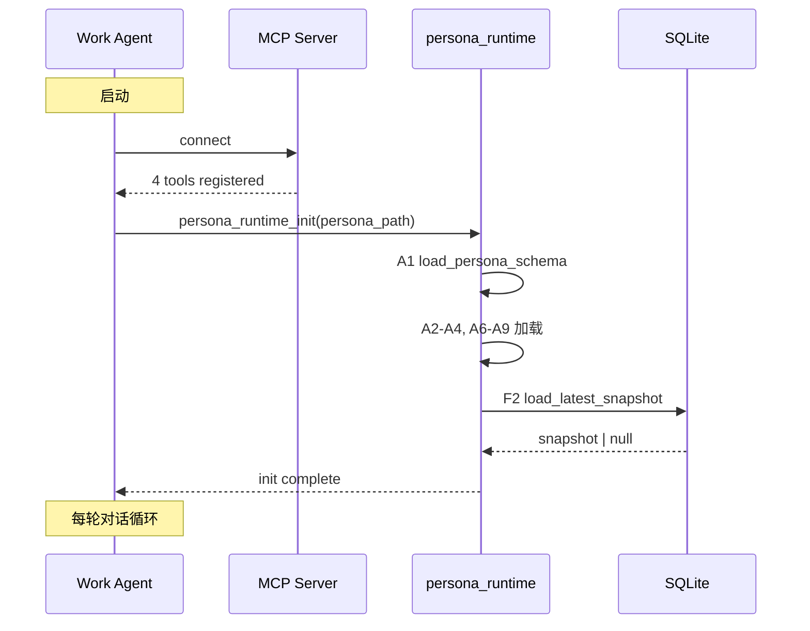
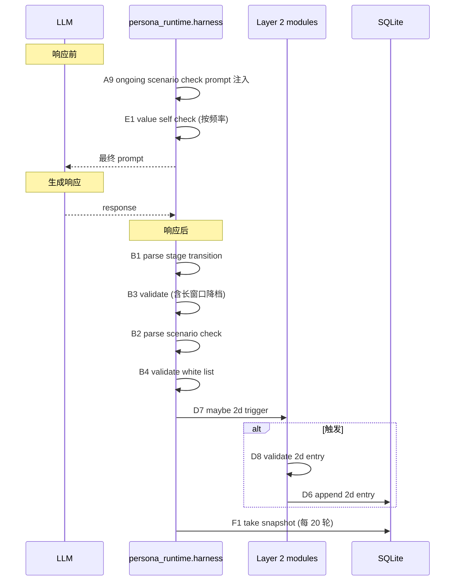
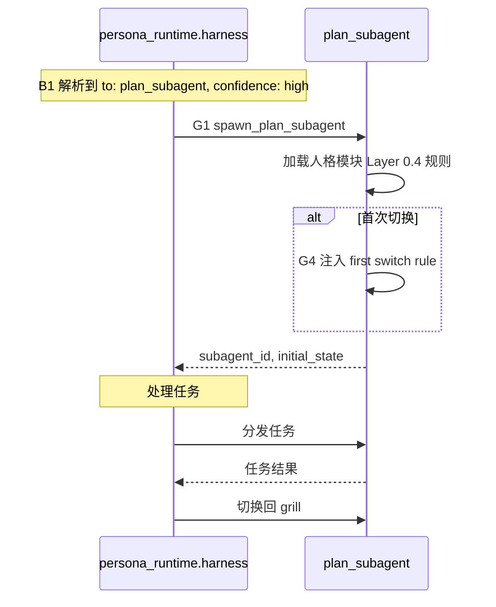

# intersoulligence — PRD（v1 工程化落地）

## 1. 需求复述

工程化落地人格模块的 v1 详细化版 **25 个**接口契约（A8 / B8 / C10 / D4 / E1 / F3 / G2 = 25）。

人格模块定义见 Wiki：`项目/agent-human/Layer0-架构设计-定稿.md`
Layer 0.3 边界规则见 Wiki：`项目/agent-human/Layer0.3-场景价值变体边界-定稿.md`
阶段切换协议见 Wiki：`项目/agent-human/Layer1.5-阶段切换信号-定稿.md`
Layer 2 衰减机制见 Wiki：`项目/agent-human/Layer2-遗忘机制-定稿.md`
harness 设计见 Wiki：`项目/agent-human/跨层-harness-定稿.md`
对照材料见 Wiki：`项目/agent-human/对照-四份材料横评.md`
接口契约 v1（按工程分类）见 Wiki：`项目/agent-human/接口-v1-按工程分类.md`
接口契约 v2（按 Layer 分类）见 Wiki：`项目/agent-human/接口-v2-按Layer分类.md`

## 2. 目标

构建一个 Python 工程，实现人格模块 **25 个** v1 接口的运行时版本，工程代号 `intersoulligence`。

> 接口列表见 `接口-v1-按工程分类.md`（按工程调用时机分组）或 `接口-v2-按Layer分类.md`（按 Layer 架构分组）。两份文档描述同一套接口，分类视角不同。

## 3. 范围

### 3.1 必须实现（v1）

| 模块 | 内容 |
|---|---|
| SQLite schema | 4 张表（2a/2b/2c/2d）+ 衰减字段（2a status/last_accessed + 2d TTL）+ 索引 |
| persona_runtime | **25 个**接口的 Python 实现 |
| harness | C5 + C6 强制约束点（人格模块自带的伦理边界） |
| MCP server | 暴露 4 个工具（persona_layer0_get / persona_layer1_get / persona_layer2_query / persona_runtime_op） |
| demo work agent | opencode 形态，跑通 12 步闭环（按 Layer 视角） |
| 关键路径测试 | 启动 → 加载 → 阶段切换 → plan_subagent → 召回 → 自评 → 持久化 → 衰减 |
| 全接口测试 | 关键路径通过后补全 **25 个**接口的单元测试 |
| 衰减机制 | F4 apply_decay 每 20 轮触发（2a 三阶段衰减 / 2d TTL） |

### 3.2 非目标（v1 不做）

- 跨人格 / 跨 agent 实例共享（不同人格模块记忆不互通）
- Postgres / DuckDB 等替代数据库
- 真实 LLM API 调用（Claude / GPT / 豆包等）—— demo 走 opencode，不接 API key
- v2 阶段加入的接口（A5/A10 个性化路径 / D1-D5 批量写入 / E2-E5 自检调度 / F3 会话总结 / G2-G3 多 subagent 协作 / H1-H2 跨 agent 一致性）

## 4. 工程栈

| 项 | 选择 | 备注 |
|---|---|---|
| 项目名 | intersoulligence | — |
| 语言 | Python | — |
| 包管理 | uv | pyproject.toml |
| 数据库 | SQLite | 单文件、单实例 |
| MCP 框架 | mcp（官方 Python SDK） | — |
| 测试框架 | pytest | — |
| demo agent | opencode | 运行时由用户手动配置 |
| License | **Apache 2.0** | — |

## 5. 工程目录结构

```
intersoulligence/
├── PRD.md                                  # 本文档
├── pyproject.toml                          # uv 项目配置
├── README.md                               # 项目说明
├── LICENSE                                 # Apache 2.0 License
├── .gitignore
├── docs/
│   ├── FEATURES.md                         # 功能追踪
│   └── CHANGELOG.md                        # 变更记录
├── persona_runtime/                        # 人格模块核心代码
│   ├── __init__.py
│   ├── config.py                           # 配置加载（数据目录 / schema 路径）
│   ├── db.py                               # SQLite 连接 + 初始化 schema
│   ├── schema_loader.py                    # A1-A4, A6-A9
│   ├── signal_parser.py                    # B1-B4
│   ├── memory_recall.py                     # C1-C6（召回 + 后处理）
│   ├── memory_write.py                      # D6-D9（写入 + 校验 + 2b 字段管理）
│   ├── self_check.py                       # E1
│   ├── persistence.py                      # F1, F2
│   ├── scheduler.py                        # G1, G4
│   └── harness.py                          # C5+C6 强制约束点
├── mcp_server/                             # MCP server
│   ├── __init__.py
│   ├── server.py                           # MCP 入口
│   └── tools/
│       ├── __init__.py
│       ├── layer0.py                       # persona_layer0_get
│       ├── layer1.py                       # persona_layer1_get
│       ├── layer2.py                       # persona_layer2_query
│       └── runtime.py                      # persona_runtime_op
├── data/
│   └── persona_schema.yaml                 # Layer 0/1 声明（YAML）
├── tests/                                  # 单元测试
│   ├── conftest.py                         # pytest fixture
│   ├── test_schema_loader.py
│   ├── test_signal_parser.py
│   ├── test_memory_recall.py                # C1-C6
│   ├── test_memory_write.py                 # D6-D9
│   ├── test_self_check.py
│   ├── test_persistence.py
│   ├── test_scheduler.py
│   ├── test_harness.py                     # C5+C6 约束测试
│   └── test_critical_path.py               # 12 步闭环
└── demo/                                   # demo work agent
    ├── README.md                           # opencode 配置说明
    ├── run.py                              # demo 入口
    └── opencode_config.example.yaml        # opencode 配置示例
```

**文件计数**：代码 19 个（persona_runtime 11 + mcp_server 7 + demo/run.py）、测试 10 个、配置 4 个、文档 5 个、其他 1 个（LICENSE），共 39 个文件。

## 6. Mermaid 流程图

### 6.1 启动闭环



### 6.2 每轮响应闭环



### 6.3 阶段切换闭环



## 7. 25 个接口 → SQL schema → MCP 工具映射

### 7.1 SQLite schema（4 张表 + 衰减字段）

> 基于架构文档 §4 收敛。2a/2b/2c/2d 各一张表，2a 加衰减状态字段，2d 加 TTL 衰减支持。

```sql
-- Layer 2a: 互动事实（高频演化 + 三阶段衰减）
CREATE TABLE interaction_memory (
    id INTEGER PRIMARY KEY AUTOINCREMENT,
    content TEXT,                      -- 可能为 null（content_wiped 后）
    type TEXT NOT NULL,                -- observation / reflection / preference / event / state
    source_conv TEXT,                  -- 来源会话 ID
    timestamp TEXT NOT NULL,           -- ISO datetime（事件发生时间）
    entities TEXT NOT NULL DEFAULT '[]',  -- JSON 数组
    channel TEXT NOT NULL DEFAULT 'direct',  -- direct / indirect / single
    status TEXT NOT NULL DEFAULT 'active',   -- active / cooling / vector_deleted / content_wiped
    last_accessed TEXT NOT NULL DEFAULT (datetime('now')),  -- 衰减计时器
    created_at TEXT NOT NULL DEFAULT (datetime('now'))
);

-- Layer 2b: 实体画像（字段级管理 + 三字段分流）
CREATE TABLE entity_profile (
    entity TEXT PRIMARY KEY,           -- 实体名（用户、产品、项目等）
    facts TEXT NOT NULL DEFAULT '[]',  -- JSON: [{content, confidence}]  -- mode: overwrite
    current_status TEXT NOT NULL DEFAULT '[]',  -- JSON: [{content, timestamp}]  -- mode: covering_update
    judgment TEXT NOT NULL DEFAULT '[]',  -- JSON: [{content, timestamp}]  -- mode: append
    updated_at TEXT NOT NULL DEFAULT (datetime('now'))
);

-- Layer 2c: 长期模式（confidence 只增不减）
CREATE TABLE long_term_patterns (
    id INTEGER PRIMARY KEY AUTOINCREMENT,
    pattern TEXT NOT NULL UNIQUE,      -- 模式描述
    confidence REAL NOT NULL DEFAULT 0.0,  -- 0-1，只增不减
    first_observed TEXT NOT NULL,      -- ISO datetime
    last_accessed TEXT NOT NULL,       -- ISO datetime（freshness 独立）
    evidence_count INTEGER NOT NULL DEFAULT 0,
    created_at TEXT NOT NULL DEFAULT (datetime('now'))
);

-- Layer 2d: 自我更新账本（人格自评 + TTL 衰减）
CREATE TABLE self_growth_ledger (
    id INTEGER PRIMARY KEY AUTOINCREMENT,
    change TEXT NOT NULL,              -- 变化内容
    reason TEXT NOT NULL,              -- 因何故
    affected_layer TEXT NOT NULL,      -- Layer 1 | Layer 2b
    timestamp TEXT NOT NULL,           -- ISO datetime
    reversible INTEGER NOT NULL DEFAULT 1,  -- 0/1
    created_at TEXT NOT NULL DEFAULT (datetime('now'))
);

-- 索引
CREATE INDEX idx_interaction_timestamp ON interaction_memory(timestamp);
CREATE INDEX idx_interaction_channel ON interaction_memory(channel);
CREATE INDEX idx_interaction_status ON interaction_memory(status);
CREATE INDEX idx_interaction_last_accessed ON interaction_memory(last_accessed);
CREATE INDEX idx_patterns_confidence ON long_term_patterns(confidence);
CREATE INDEX idx_ledger_timestamp ON self_growth_ledger(timestamp);
```

### 7.2 接口 → schema → MCP 工具映射（25 个接口）

| 接口 | SQL 表 | 字段 / 操作 | MCP 工具 | operation |
|---|---|---|---|---|
| **A1** load_persona_schema | — | 文件读取 | persona_layer0_get | schema |
| **A2** get_identity_anchors | — | 文件读取 | persona_layer0_get | anchors |
| **A3** get_value_kernel | — | 文件读取 | persona_layer0_get | value_kernel |
| **A4** get_available_scenarios | — | 文件读取 | persona_layer0_get | scenarios |
| **A6** get_self_check_policy | — | 文件读取 | persona_layer0_get | self_check_policy |
| **A7** get_stage_signal_prompt | — | 文件读取 | persona_layer1_get | stage_signal_prompt |
| **A8** get_initial_scenario_check_prompt | — | 文件读取 | persona_layer0_get | initial_scenario_check |
| **A9** get_ongoing_scenario_check_prompt | — | 文件读取 | persona_layer1_get | ongoing_scenario_check |
| **B1** parse_stage_transition | — | 字符串解析 | persona_runtime_op | parse_stage_transition |
| **B2** parse_scenario_check | — | 字符串解析 | persona_runtime_op | parse_scenario_check |
| **B3** validate_stage_transition | interaction_memory | 查询近 N 轮违规率 | persona_runtime_op | validate_stage_transition |
| **B4** validate_scenario_check | — | 白名单校验 | persona_runtime_op | validate_scenario_check |
| **C1** recall_2a | interaction_memory | SELECT（更新 last_accessed） | persona_layer2_query | recall_2a |
| **C2** recall_2b | entity_profile | SELECT | persona_layer2_query | recall_2b |
| **C3** recall_2c | long_term_patterns | SELECT（更新 last_accessed） | persona_layer2_query | recall_2c |
| **C4** recall_2d | self_growth_ledger | SELECT | persona_layer2_query | recall_2d |
| **C5** apply_recall_permission | interaction_memory | channel 字段判定 | persona_runtime_op | apply_recall_permission |
| **C6** rewrite_voice | — | 语态改写 | persona_runtime_op | rewrite_voice |
| **D6** append_2d_entry | self_growth_ledger | INSERT | persona_layer2_query | append_2d |
| **D7** maybe_2d_trigger | interaction_memory, self_growth_ledger | SELECT 最近 N 条 | persona_layer2_query | maybe_2d_trigger |
| **D8** validate_2d_entry | — | 伦理约束检测 | persona_runtime_op | validate_2d_entry |
| **D9** write_2b_entry | entity_profile | UPDATE（按字段分流） | persona_layer2_query | write_2b |
| **E1** value_self_check | — | 价值层校验 | persona_runtime_op | value_self_check |
| **F1** take_snapshot | 多表聚合 | 计算 violation_rate | persona_runtime_op | take_snapshot |
| **F2** load_latest_snapshot | 文件系统 | 读取最近快照 | persona_runtime_op | load_latest_snapshot |
| **F4** apply_decay | interaction_memory, self_growth_ledger | UPDATE / DELETE | persona_runtime_op | apply_decay |
| **G1** spawn_plan_subagent | — | 进程管理 | persona_runtime_op | spawn_plan_subagent |
| **G4** inject_plan_subagent_first_switch_rule | — | 规则注入 | persona_runtime_op | inject_plan_subagent_rule |

### 7.3 MCP 工具签名

#### persona_layer0_get

```yaml
输入:
  field: enum[schema, anchors, value_kernel, scenarios, self_check_policy, initial_scenario_check]
输出:
  data: <对应字段的完整数据>
错误:
  - field 不识别 → 拒绝
  - 数据未初始化 → 拒绝
```

#### persona_layer1_get

```yaml
输入:
  field: enum[stage_signal_prompt, ongoing_scenario_check]
  current_scenario: string  # 仅 ongoing_scenario_check 必填
输出:
  data: <对应字段的 prompt 模板>
错误:
  - field 缺失 current_scenario → 拒绝
  - 当前场景不在白名单 → 回退到首轮
```

#### persona_layer2_query

```yaml
输入:
  operation: enum[
    recall_2a, recall_2b, recall_2c, recall_2d,
    append_2d, maybe_2d_trigger,
    write_2b
  ]
  # 各 operation 不同的 params
输出:
  data: <查询/写入结果>
错误:
  - operation 不识别 → 拒绝
  - 写入触发伦理违规 → 拒绝 + 冲突条款
```

#### persona_runtime_op

```yaml
输入:
  operation: enum[
    parse_stage_transition,
    parse_scenario_check,
    validate_stage_transition,
    validate_scenario_check,
    apply_recall_permission,
    rewrite_voice,
    validate_2d_entry,
    value_self_check,
    take_snapshot,
    load_latest_snapshot,
    apply_decay,
    spawn_plan_subagent,
    inject_plan_subagent_rule
  ]
  # 各 operation 不同的 params
输出:
  data: <操作结果>
错误:
  - operation 不识别 → 拒绝
  - 参数缺失 → 拒绝 + 缺失字段名
```

## 8. 关键路径测试（12 步闭环，按 Layer 视角）

**测试文件**：`tests/test_critical_path.py`

> v1 收敛到 25 个接口后，关键路径闭环从 9 步扩到 12 步（按 Layer 视角）。完整闭环见 `接口-v2-按Layer分类.md` §"v1 验收标准"。

### Layer 0 闭环（3 步）

| 步骤 | 验证内容 |
|---|---|
| 1. 启动加载 | A1 / A2 / A3 / A4 / A6 全部返回正确数据 |
| 2. 快照加载 | F2 加载最近快照（无则 fresh_start） |
| 3. 首轮场景自检 | A8 注入 prompt + B2 解析初始场景 |

### Layer 1 闭环（3 步）

| 步骤 | 验证内容 |
|---|---|
| 4. 持续场景自检 | A9 注入 prompt + B2 解析 stay/switch_to |
| 5. 价值层自检 | E1 检测违规 + 行动决策 |
| 6. 阶段切换 | B1 解析 + B3 校验 + G1 启动 subagent |

### Layer 2 闭环（4 步）

| 步骤 | 验证内容 |
|---|---|
| 7. 召回原始数据 | C1 / C2 / C3 / C4 召回（按层分流） |
| 8. 召回后处理 | C5 应用 permission + C6 语态改写 → 注入 prompt |
| 9. Layer 2d 自评 | D7 触发 + D8 校验 + D6 写入 |
| 10. 2b 字段写入 | D9 write_2b_entry（按字段分流：facts / current_status / judgment） |

### 跨层辅佐闭环（2 步）

| 步骤 | 验证内容 |
|---|---|
| 11. 快照 + 衰减 | F1 每 20 轮落盘 + F4 apply_decay 跑衰减（2a 三阶段 / 2d TTL） |
| 12. plan_subagent 启动 | G1 启动 + G4 注入 first switch rule（首次切换时） |

**判定**：12 步全部通过 = 关键路径 PASS，可以进入全接口测试阶段。

## 9. 全接口测试（25 个）

**测试文件分布**：

| 测试文件 | 覆盖接口 |
|---|---|
| `tests/test_schema_loader.py` | A1, A2, A3, A4, A6, A7, A8, A9（8 个） |
| `tests/test_signal_parser.py` | B1, B2, B3, B4（4 个） |
| `tests/test_memory_recall.py` | C1, C2, C3, C4, C5, C6（6 个，召回 + 后处理） |
| `tests/test_memory_write.py` | D6, D7, D8, D9（4 个，写入 + 校验 + 2b 字段管理） |
| `tests/test_self_check.py` | E1（1 个） |
| `tests/test_persistence.py` | F1, F2, F4（3 个，含衰减） |
| `tests/test_scheduler.py` | G1, G4（2 个） |
| **合计** | **25 个接口** |

## 10. 验收标准

### 10.1 关键路径验收

- [x] `tests/test_critical_path.py` 12 步全部通过（按 Layer 视角）（实测 12/12，2026-08-26）
- [x] Layer 0 闭环：F2 加载快照 + A8 首轮场景自检
- [x] Layer 1 闭环：A9 持续场景自检 + E1 价值层自检 + B1/B3 阶段切换
- [x] Layer 2 召回路径：C1-C4 召回 + C5/C6 后处理
- [x] Layer 2 写入路径：D7/D8/D6 自评路径 + D9 2b 字段写入
- [x] 持久化 + 衰减路径：F1 落盘 + F4 apply_decay（2a 三阶段 / 2d TTL）
- [x] plan_subagent 启动：G1 启动 + G4 注入 first switch rule

### 10.2 全接口验收

- [x] `tests/` 下测试文件全部通过（实际 10 个文件、129 用例全过）
- [x] **25 个**接口 100% 覆盖（每个接口至少 1 个测试用例）
- [x] pytest 覆盖率 ≥ 80%（核心模块）（全项目实测 92%：persona_runtime 82%~98%，mcp_server 88%~100%）
- [x] harness.py 的 C5+C6 约束至少 3 个测试用例（cite / cautious / associate-only）（恰 3 个）
- [x] F4 apply_decay 至少 4 个测试用例（2a cooling / vector_deleted / content_wiped / 2d TTL）（7 个）

### 10.3 demo 验收

- [x] `demo/run.py` 在 opencode 环境下能跑通 12 步闭环（本地 canned response 模式实测 12/12 PASS）
- [x] opencode 配置示例文件 `demo/opencode_config.example.yaml` 可用（YAML 解析通过）
- [ ] 用户手动配置 opencode 环境后，demo 能输出人格模块的预期响应（**用户侧待办**）

## 11. 文件级修改计划（依赖顺序）

依赖顺序：1 → 2 → ... → 27

| 序号 | 文件 | 依赖 | 改动内容 |
|---|---|---|---|
| 1 | `pyproject.toml` | — | uv 项目配置 + 依赖 |
| 2 | `.gitignore` | — | Python / SQLite 忽略规则 |
| 3 | `LICENSE` | — | Apache 2.0 License 文本 |
| 4 | `README.md` | 1 | 项目说明 |
| 5 | `docs/FEATURES.md` | 1 | 功能追踪初始条目 |
| 6 | `docs/CHANGELOG.md` | 1 | 变更记录初始 |
| 7 | `data/persona_schema.yaml` | — | Layer 0/1 声明（YAML） |
| 8 | `persona_runtime/config.py` | 1 | 配置加载 |
| 9 | `persona_runtime/db.py` | 7, 8 | SQLite 连接 + 初始化 schema |
| 10 | `persona_runtime/schema_loader.py` | 7, 8 | A1-A4, A6-A9 |
| 11 | `persona_runtime/signal_parser.py` | 10 | B1, B2, B3, B4 |
| 12 | `persona_runtime/memory_recall.py` | 9, 10 | C1, C2, C3, C4, C5, C6（召回 + 后处理） |
| 13 | `persona_runtime/memory_write.py` | 9, 10 | D6, D7, D8, D9（写入 + 校验 + 2b 字段管理） |
| 14 | `persona_runtime/self_check.py` | 10 | E1 |
| 15 | `persona_runtime/persistence.py` | 9 | F1, F2, F4（含衰减） |
| 16 | `persona_runtime/scheduler.py` | 10 | G1, G4 |
| 17 | `persona_runtime/harness.py` | 11, 12, 13, 14, 15, 16 | C5+C6 强制约束点 + 主循环 |
| 18 | `persona_runtime/__init__.py` | 8-17 | 包导出 |
| 19 | `mcp_server/tools/layer0.py` | 10 | persona_layer0_get |
| 20 | `mcp_server/tools/layer1.py` | 10 | persona_layer1_get |
| 21 | `mcp_server/tools/layer2.py` | 12, 13 | persona_layer2_query |
| 22 | `mcp_server/tools/runtime.py` | 11, 12, 13, 14, 15, 16 | persona_runtime_op |
| 23 | `mcp_server/server.py` | 19-22 | MCP server 入口 |
| 24 | `mcp_server/__init__.py` | 23 | 包导出 |
| 25 | `tests/conftest.py` | 9 | pytest fixture |
| 26 | `tests/test_critical_path.py` | 25 | 12 步闭环测试 |
| 27 | `tests/test_*.py`（其余 6 个） | 25 | 全接口测试 |
| 28 | `demo/run.py` + `demo/opencode_config.example.yaml` + `demo/README.md` | 17, 23 | demo 入口 + opencode 配置 |

**说明**：
- 序号 1-6：项目骨架（无依赖）
- 序号 7：数据声明（独立）
- 序号 8-17：persona_runtime（核心代码）
- 序号 18-23：MCP server
- 序号 24-26：测试
- 序号 27：demo

## 12. 风险与回退

| 风险 | 回退策略 |
|---|---|
| MCP 工具签名调试复杂 | 先做 9 步闭环跑通 + 测试通过，再接 MCP |
| opencode 运行时配置遇到问题 | 提供 example config + README 说明 |
| SQLite 并发问题（人格模块 + work agent 同时写） | v1 用 WAL 模式 + 串行化写入 |
| 价值层自检误判 | E1 违规时只 regenerate 1 次，避免无限循环 |
| 长窗口降档逻辑复杂 | v1 用简化的滑动窗口（最近 100 轮） |

## 13. 影响范围

⚡ 影响范围：
- **新增工程**：`intersoulligence/`（28 个文件，含拆分后的 memory_recall / memory_write）
- **数据契约**：`data/persona_schema.yaml` 是 Layer 0/1 的事实声明，未来人格模块调整需修改此文件
- **接口契约**：25 个接口的输入输出与 Wiki `项目/agent-human/接口-v1-按工程分类.md` 一致，修改时需要双向同步
- **数据库**：SQLite 单文件路径在 `data/persona.db`（默认），含 2a 衰减字段（status / last_accessed）+ 2d TTL 字段
- **衰减机制**：F4 apply_decay 每 20 轮触发，2a 三阶段（cooling/vector_deleted/content_wiped）+ 2d TTL（≥180 天）
- **测试基线**：12 步关键路径通过是进入全接口测试的前提

## 14. 修订记录

- 2026-08-14：初版 PRD。完成 21 个接口的工程化映射、MCP 工具签名、9 步闭环验收、文件级修改计划。
- 2026-08-14 22:30：v2 全量对齐。**关键变更**：接口 21 → **25 个**（补回 C1-C4 召回 + 新增 D9 2b 字段管理 + 新增 F4 衰减机制）；关键路径 9 步 → **12 步**（按 Layer 视角重组）；第 11 章文件级修改计划拆分 memory.py → memory_recall.py + memory_write.py；SQL schema 加 2a 衰减字段（status / last_accessed）+ 索引；MCP 工具 operation 列表扩到 7 + 13 个。**对齐目标**：与 Wiki `接口-v1-按工程分类.md` + `接口-v2-按Layer分类.md` + `Layer2-遗忘机制-定稿.md` 保持一致。
- 2026-08-14 22:30：所有 Wiki 引用同步到新文件名（Layer0-架构设计-定稿 / Layer0.3-场景价值变体边界-定稿 / Layer1.5-阶段切换信号-定稿 / Layer2-遗忘机制-定稿 / 跨层-harness-定稿 / 接口-v1-按工程分类 / 接口-v2-按Layer分类 / 对照-四份材料横评）。
- 2026-08-26 03:45：License 由 MIT 改为 **Apache 2.0**（第 4 章工程栈 / 第 5 章目录结构 / 第 11 章文件级修改计划 三处同步修正）。
- 2026-08-26 17:30：验收核销与结构图同步。§5 目录结构同步 memory 拆分（memory_recall / memory_write）与 test_memory 拆分；§10 验收标准按实测核销（129 用例全过 / persona_runtime 核心覆盖率 82%~98% / demo 12/12 PASS）；代码托管于 GitHub `GreyzAchilles/Intersoulligence`。遗留：mcp_server 单测补齐、用户侧 opencode 环境实测。
- 2026-08-26 18:10：补齐 mcp_server 单元测试（`tests/test_mcp_server.py` 39 用例），TOTAL 覆盖率 78% → **92%**。修复两个由测试暴露的缺陷：① mcp 2.x 移除 FastMCP 导致 server 入口 RuntimeError → `server.py` 改为 MCPServer（2.x）/ FastMCP（1.x）双版本导入兼容；② SQLite 连接开启 `check_same_thread=False`（MCP 工具处理器运行于任意工作线程，写入串行化仍由 PRD §12 WAL + 单实例保证）。遗留：用户侧 opencode 环境实测。